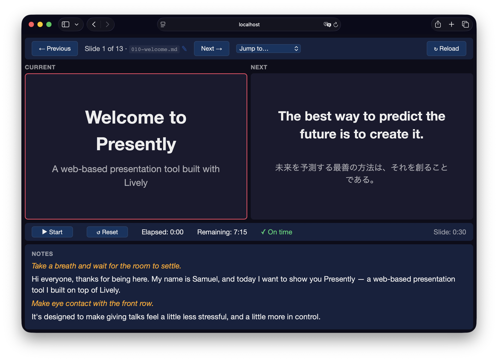

# Presently

A web-based presentation tool built with [Lively](https://github.com/socketry/lively). Write your slides in Markdown, present them in the browser, and control everything from a separate presenter display.



[](https://github.com/socketry/presently/actions?workflow=Test)

## Features

  - **Markdown slides** with YAML frontmatter for metadata and template selection.
  - **Presenter display** with current slide, next slide preview, notes, and timing.
  - **Real-time sync** between display and presenter via WebSockets.
  - **Code highlighting** with [@socketry/syntax](https://github.com/socketry/syntax-js), including animated focus regions for code walkthroughs.
  - **Multiple templates** — title, section, two-column, code, translation, image, and default.
  - **Timing and pacing** — per-slide duration metadata with elapsed/remaining time and pacing indicators.
  - **Full-screen support** — press `F` on the display view.
  - **Keyboard navigation** — arrow keys, space, Page Up/Down.

## Usage

Please see the [project documentation](https://socketry.github.io/presently/) for more details.

  - [Getting Started](https://socketry.github.io/presently/guides/getting-started/index) - This guide explains how to use `presently` to create and deliver web-based presentations using Markdown slides.

  - [Animating Slides](https://socketry.github.io/presently/guides/animating-slides/index) - This guide explains how to animate content within slides using the `morph` transition and the slide scripting system.

## Releases

Please see the [project releases](https://socketry.github.io/presently/releases/index) for all releases.

### v0.11.0

  - Add `Slide#element` and `SlideContext#element` getters — expose the slide body DOM element directly for cases where `find()` is not sufficient, such as measuring dimensions, attaching event listeners, or integrating third-party libraries.

### v0.10.0

  - Replace internal `SlideChain` with an exported `SlideContext` class. `SlideContext` accumulates elapsed time across `after()` calls exactly as `SlideChain` did, but also exposes `find()`, `setTimeout()`, and a `get elapsed()` getter. `Slide#after()` now returns a `SlideContext` — existing slide scripts are unaffected.
  - Add `Slide#loop(callback, {delay})` — runs a callback in a repeating loop until the slide changes. The callback receives a fresh `SlideContext` each iteration so it can schedule steps with `after()`. The loop waits for all steps to complete (`context.elapsed`) plus an optional extra `delay` before starting the next iteration. All timeouts flow through the slide's existing tracked `setTimeout`, so they are cancelled automatically on slide change.

### v0.9.0

  - `SlideBuilder#show` and `SlideBuilder#next` no longer overwrite `view-transition-name` on elements that already have one set. This allows elements with explicit names (for morph transitions to other slides) to coexist with the build system — they still get `visibility` and `viewTransitionClass` managed, but keep their own name.

### v0.8.0

  - Add optional `translation` section to the `default` template.

### v0.7.0

  - Rework build effects to use direct CSS class animation rather than `view-transition-class`. `build-fade`, `build-fly-up`, etc. are now regular `@keyframes` classes applied to the revealed element, rather than view transition pseudo-element selectors. This decouples in-slide sequential animation from slide-level morph transitions.
  - Rename `SlideElements#build` to `SlideElements#show` for clarity — `boxes.show(0)` / `boxes.show(3)` more clearly describes the outcome from the audience's perspective.
  - Add `SlideElements#builder(options)` — returns a `SlideBuilder` with default options (group, effect) and a cached position, so callers can use `next()` instead of tracking the step count manually.
  - Add `SlideBuilder#show(count, overrides)` — set visibility state to an arbitrary position. Returns a `Promise` that resolves when the reveal animation completes (or immediately when no effect is given).
  - Add `SlideBuilder#next(overrides)` — reveal the next element with the builder's default effect, optionally overridden per call. O(1): only touches the single newly revealed element. Returns a `Promise`.
  - Add `SlideBuilder#play(interval, callback)` — reveals all remaining elements in sequence with `interval` milliseconds between each. An optional callback is invoked after each reveal; return `false` to stop playback early. Requires the builder to be created via `slide.find(...).builder()` so timeouts are tracked and cancelled on slide change.
  - Add `SlideBuilder#finished` getter — returns `true` when all elements have been revealed.
  - Add `Slide#after(delay, callback)` — schedules a callback after a delay in milliseconds and returns a `SlideChain`. Subsequent `.after(delay, callback)` calls on the chain fire relative to the previous step, making sequential reveal timing easy to read and adjust.
  - Add `Slide#setTimeout(callback, delay)` — a tracked replacement for the global `setTimeout`. All timeouts registered this way are automatically cancelled when the slide changes, preventing stale callbacks from firing after navigation. The global `setTimeout` in slide scripts is shadowed by this method automatically.
  - Add `Slide#cancelTimeouts()` — cancels all pending timeouts registered by the slide's script. Called automatically by the presentation engine on every slide change.

### v0.6.0

  - Add `bake presently:slides:speakers` task to print a timing breakdown grouped by speaker. Each speaker's slides are listed in presentation order with individual and total durations, making it easy to balance talk time in multi-speaker presentations. Slides without a `speaker` key are grouped under `(no speaker)`.

### v0.5.0

  - Add optional `speaker` front matter key to slides. When present, the current speaker's name is shown in the timing bar. If the next slide has a different speaker, a handoff indicator (e.g. `→ Next Speaker`) is shown alongside, giving presenters an at-a-glance cue for tag-team talks.

### v0.4.0

  - Add `bake presently:slides:notes` task to extract all presenter notes into a single Markdown document, with each slide's file path as a heading. Useful for reviewing or sharing speaker notes outside of the presentation.
  - Presenter notes are now kept as a Markdown AST internally and rendered to HTML on demand, so the notes you write are faithfully round-tripped rather than converted to HTML at parse time.

### v0.3.0

  - Add `diagram` template with a `position: relative` container — direct `<div>` children are `position: absolute` by default for free-form layouts.
  - All slide templates now have `position: relative` on the slide inner container, allowing absolutely positioned overlays in any template.
  - Add slide scripting: a fenced ` ```javascript ``` ` block at the end of presenter notes is extracted and executed in the browser after each slide renders. The script receives a `slide` object scoped to the slide body.
  - Add `Slide#find(selector)` — a pure CSS selector query returning a `SlideElements` collection with no side effects.
  - Add `SlideElements#build(n, options)` — shows the first `n` matched elements, hides the rest, and assigns `view-transition-name` for morph transition matching. Accepts `group` (name prefix) and `effect` (entry animation) options.
  - Add build effects via `view-transition-class`: `fade`, `fly-left`, `fly-right`, `fly-up`, `fly-down`, `scale`. Requires Chromium 125+; degrades gracefully to instant appear in other browsers.
  - Rename `magic-move` transition to `morph`.
  - Italic text in presenter notes is styled in amber to distinguish stage directions from spoken words.
  - Add transitions guide and animating slides guide to documentation.

### v0.2.0

  - Use Markly's native front matter parser (`Markly::FRONT_MATTER`) instead of manual string splitting, parsing each slide document once and extracting front matter directly from the AST.
  - Use the last `---` hrule in the AST as the presenter notes separator, so earlier `---` dividers in slide content are preserved correctly.
  - Add support for Mermaid diagrams in slides.

## See Also

  - [lively](https://github.com/socketry/lively) — The real-time application framework that powers Presently.
  - [falcon](https://github.com/socketry/falcon) — The web server used to host presentations.
  - [syntax-js](https://github.com/socketry/syntax-js) — Syntax highlighting for code slides.
  - [markly](https://github.com/socketry/markly) — CommonMark parser used for slide content.

## Contributing

We welcome contributions to this project.

1.  Fork it.
2.  Create your feature branch (`git checkout -b my-new-feature`).
3.  Commit your changes (`git commit -am 'Add some feature'`).
4.  Push to the branch (`git push origin my-new-feature`).
5.  Create new Pull Request.

### Running Tests

To run the test suite:

``` shell
bundle exec sus
```

### Making Releases

To make a new release:

``` shell
bundle exec bake gem:release:patch # or minor or major
```

### Developer Certificate of Origin

In order to protect users of this project, we require all contributors to comply with the [Developer Certificate of Origin](https://developercertificate.org/). This ensures that all contributions are properly licensed and attributed.

### Community Guidelines

This project is best served by a collaborative and respectful environment. Treat each other professionally, respect differing viewpoints, and engage constructively. Harassment, discrimination, or harmful behavior is not tolerated. Communicate clearly, listen actively, and support one another. If any issues arise, please inform the project maintainers.
