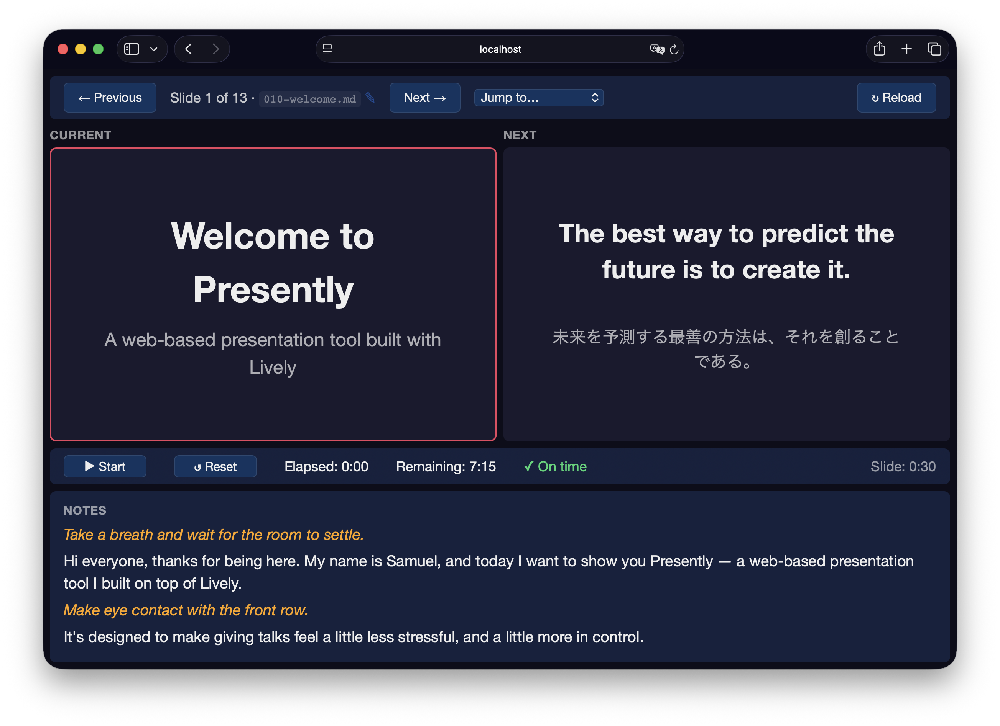

# Presently

A web-based presentation tool built with [Lively](https://github.com/socketry/lively). Write your slides in Markdown, present them in the browser, and control everything from a separate presenter display.



[](https://github.com/socketry/presently/actions?workflow=Test)

## Features

  - **Markdown slides** with YAML frontmatter for metadata and template selection.
  - **Presenter display** with current slide, next slide preview, notes, and timing.
  - **Real-time sync** between display and presenter via WebSockets.
  - **Code highlighting** with [@socketry/syntax](https://github.com/socketry/syntax-js), including animated focus regions for code walkthroughs.
  - **Multiple templates** — title, section, two-column, code, translation, image, and default.
  - **Colocated styles** — presentation, directory, and slide-specific CSS can live beside the slides it styles.
  - **Timing and pacing** — per-slide duration metadata with elapsed/remaining time and pacing indicators.
  - **Slide narration** — record, review, and retake one audio track per slide from a dedicated recording interface.
  - **Narrated playback** — automatically play each slide with its recorded narration, including slide scripts and transitions.
  - **Full-screen support** — press `F` on the display view.
  - **Keyboard navigation** — arrow keys, space, Page Up/Down.

## Usage

Please see the [project documentation](https://socketry.github.io/presently/) for more details.

  - [Getting Started](https://socketry.github.io/presently/guides/getting-started/index) - This guide explains how to use `presently` to create and deliver web-based presentations using Markdown slides.

  - [Animating Slides](https://socketry.github.io/presently/guides/animating-slides/index) - This guide explains how to animate content within slides using the slide scripting system.

  - [Animated Diagrams](https://socketry.github.io/presently/guides/animated-diagrams/index) - This guide explains how to design responsive, lifecycle-safe animated diagrams in Presently using semantic markup, slide-specific CSS, and Anime.js choreography.

### Recording Narration

Open `http://localhost:9292/record` to record narration separately from the live presenter interface. Presently stores one WebM/Opus recording per slide under `audio/`, mirroring the slide's relative path:

``` text
slides/020-problem/010-overview.md
audio/020-problem/010-overview.webm
```

The interface preserves the microphone's dynamics for offline normalization and excludes mouse clicks at the recording boundaries using a short delayed audio pipeline. An existing recording is preserved until a completed retake is explicitly saved.

After recording, normalize every completed take to a consistent `-16 LUFS` target:

``` shell
bundle exec bake presently:recordings:normalize
```

The task preserves the original files under `audio/` and writes normalized copies to matching paths under `audio-normalized/`. It requires FFmpeg.

Open `http://localhost:9292/playback` to watch the narrated presentation. Playback uses normalized audio when available, falls back to the original recording, and advances when each track ends.

For automated capture, use `http://localhost:9292/playback?autoplay=true&controls=false`. The page exposes `window.__PRESENTLY_PLAYBACK_READY` and `window.__PRESENTLY_PLAYBACK_FINISHED`, and dispatches matching `presently:playback-ready` and `presently:playback-finished` events.

To export playback directly to an MP4 file using a Chromium build that supports `Page.startScreenRecording`:

``` shell
PRESENTLY_CHROME_PATH=/path/to/chromium \
PRESENTLY_CHROMEDRIVER_PATH=/path/to/chromedriver \
bundle exec bake presently:export:video output=presentation.mp4
```

The task records the presentation at 1920×1080 and 30 frames per second by default. Use `width`, `height`, and `frame_rate` to select different limits. If explicit browser paths are omitted, Presently tries the current Chrome for Testing canary build.

## Releases

Please see the [project releases](https://socketry.github.io/presently/releases/index) for all releases.

### v0.18.0

  - Render slides on a responsive 16:9 canvas across the display, presenter, recording, playback, and export interfaces.
  - Center diagram content by default, add optional diagram titles, and make free-form absolute positioning explicit with `.diagram-freeform`.
  - Prevent slide backgrounds and content from flickering during view transitions.
  - Add lifecycle-managed Anime.js animation scopes, reusable diagram setup scripts, and guidance for authoring animated diagrams.
  - Truncate long slide paths responsively while preserving their filenames in presenter controls.
  - Preserve the complete saved presentation state when restoring the controller.

### v0.17.2

  - Fix slide rendering events for generated view identifiers that begin with a digit.

### v0.17.1

  - Add slide-scoped resource cleanup with `Slide#defer`, `Slide#signal`, and idempotent `Slide#dispose`. Existing tracked timeouts now use the same disposal lifecycle.
  - [Web Packages](https://socketry.github.io/presently/releases/index#web-packages)

### v0.16.0

  - Add support for organizing slides in nested directories. Every directory and slide filename must begin with a numeric prefix, and slides are ordered by relative path.

### v0.15.0

q

  - Export works from current working directory.
      - Remove explicit support for `morph` transition.

### v0.14.0

  - Increase code font size by 50%.
  - Add support for includes using `![[path]]` syntax.
  - Add `bake presently:rehearse` tasks for updating timing information.

### v0.13.0

  - Change zoom to 50% on slide preview (presenter display).

### v0.12.0

  - Add support for translation to code slide.

### v0.11.0

  - Add `Slide#element` and `SlideContext#element` getters — expose the slide body DOM element directly for cases where `find()` is not sufficient, such as measuring dimensions, attaching event listeners, or integrating third-party libraries.

### v0.10.0

  - Replace internal `SlideChain` with an exported `SlideContext` class. `SlideContext` accumulates elapsed time across `after()` calls exactly as `SlideChain` did, but also exposes `find()`, `setTimeout()`, and a `get elapsed()` getter. `Slide#after()` now returns a `SlideContext` — existing slide scripts are unaffected.
  - Add `Slide#loop(callback, {delay})` — runs a callback in a repeating loop until the slide changes. The callback receives a fresh `SlideContext` each iteration so it can schedule steps with `after()`. The loop waits for all steps to complete (`context.elapsed`) plus an optional extra `delay` before starting the next iteration. All timeouts flow through the slide's existing tracked `setTimeout`, so they are cancelled automatically on slide change.

## See Also

  - [lively](https://github.com/socketry/lively) — The real-time application framework that powers Presently.
  - [falcon](https://github.com/socketry/falcon) — The web server used to host presentations.
  - [syntax-js](https://github.com/socketry/syntax-js) — Syntax highlighting for code slides.
  - [markly](https://github.com/socketry/markly) — CommonMark parser used for slide content.

## Contributing

We welcome contributions to this project.

1.  Fork it.
2.  Create your feature branch (`git checkout -b my-new-feature`).
3.  Commit your changes (`git commit -am 'Add some feature'`).
4.  Push to the branch (`git push origin my-new-feature`).
5.  Create new Pull Request.

### Running Tests

To run the test suite:

``` shell
bundle exec sus
```

### Making Releases

To make a new release:

``` shell
bundle exec bake gem:release:patch # or minor or major
```

### Developer Certificate of Origin

In order to protect users of this project, we require all contributors to comply with the [Developer Certificate of Origin](https://developercertificate.org/). This ensures that all contributions are properly licensed and attributed.

### Community Guidelines

This project is best served by a collaborative and respectful environment. Treat each other professionally, respect differing viewpoints, and engage constructively. Harassment, discrimination, or harmful behavior is not tolerated. Communicate clearly, listen actively, and support one another. If any issues arise, please inform the project maintainers.
