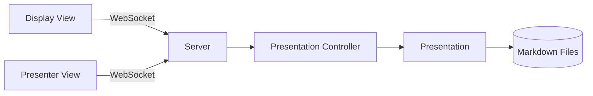

---

Walk through the architecture diagram. The server holds all state, and both browser views connect via WebSockets. The controller manages navigation and timing, while the presentation loads slides from disk.
