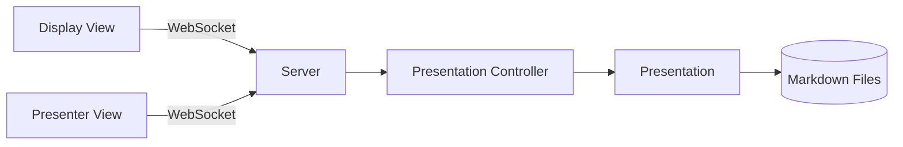

---

*Give the diagram a moment to render before speaking.*

Here's a bird's eye view of how Presently fits together. Both browser windows — the display and the presenter view — connect to the same server over WebSockets. The server runs a single Presentation Controller that owns all the state.

When you advance a slide in the presenter view, that event travels up to the controller, which updates the Presentation and notifies every connected client. The display updates in under a millisecond. There's no refresh, no polling — just a push.
